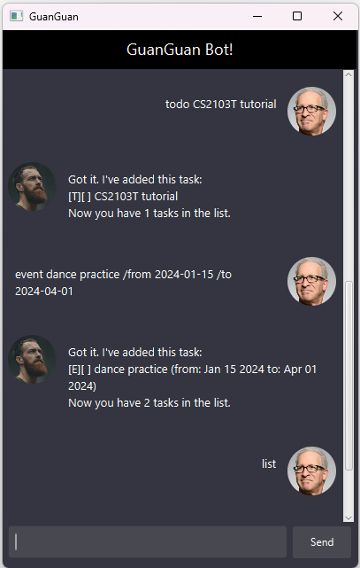

# GuanGuan User Guide



## GuanGuan is designed for efficient task management to streamline your daily tasks and enhance productivity.

# Features:

## List tasks: `list`
List all tasks in the task list.

Format: `list`

Output:
```
Here are the tasks in your list:
1. [T][] complete CS2103T tutorial
2. [D][] dance practice (by: May 05 2024)
```

## Add todo: `todo`
Add a todo task to the task list.

Format: `todo DESCRIPTION`

Examples:
- `todo complete CS2103T tutorial`

Output:
```
Got it. I've added this task:
[T][] complete CS2103T tutorial
Now you have 1 tasks in the list.
```

## Add deadline: `deadline`
Add a deadline task to the task list.

Format: `deadline DESCRIPTION /by DATE`

Examples:
- `deadline complete CS2103T tutorial /by 2024-05-05`

Output:
```
Got it. I've added this task:
[D][] complete CS2103T tutorial (by: May 05 2024)
Now you have 1 tasks in the list.
```

## Add event: `event`
Add an event task to the task list.

Format: `event DESCRIPTION /from DATE /by DATE`

Examples:
- `event complete CS2103T tutorial /from 2024-05-05 /to 2024-05-15`

Output:
```
Got it. I've added this task:
[E][] complete CS2103T tutorial (from: May 05 2024 to: May 15 2024)
Now you have 1 tasks in the list.
```

## Mark task: `mark`
Mark task as done.

Format: `mark ID`

Examples:
- `mark 1`

Output:
```
Nice! I've marked this task as done:
[T][X] complete CS2103T tutorial
```

## Unmark task: `unmark`
Mark task as undone.

Format: `unmark ID`

Examples:
- `unmark 1`

Output:
```
OK, I've marked this task as not done yet:
[T][] complete CS2103T tutorial
```

## Delete task: `delete`
Delete task from the task list.

Format: `delete ID`

Examples:
- `delete 1`

Output:
```
Noted. I've removed this task:
[T][] complete CS2103T tutorial
Now you have 0 tasks in the list.
```

## Find task: `find`
Find tasks that contain the keyword.

Format: `find KEYWORD`

Examples:
- `find tut`

Output:
```
Here are the tasks in your list:
1. [T][] complete CS2103T tutorial
```

## Exit: `bye`
Exit the program.

Format: `bye`

Output:
```
Bye. Hope to see you again soon!
```

## Saving the data
Data are saved in the hard disk automatically after any command that changes the data. There is no need to save manually.

## Editing the data file
Data are saved automatically as a text file [JAR file location]/data/test.txt. Advanced users are welcome to update data directly by editing that data file.